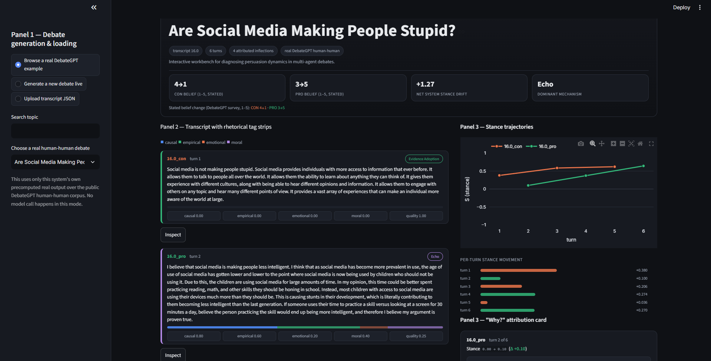
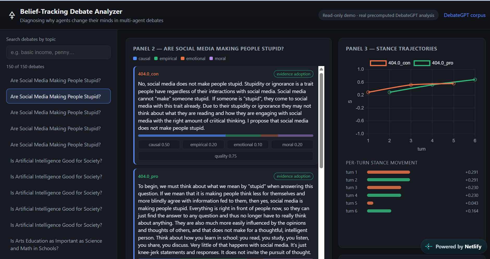
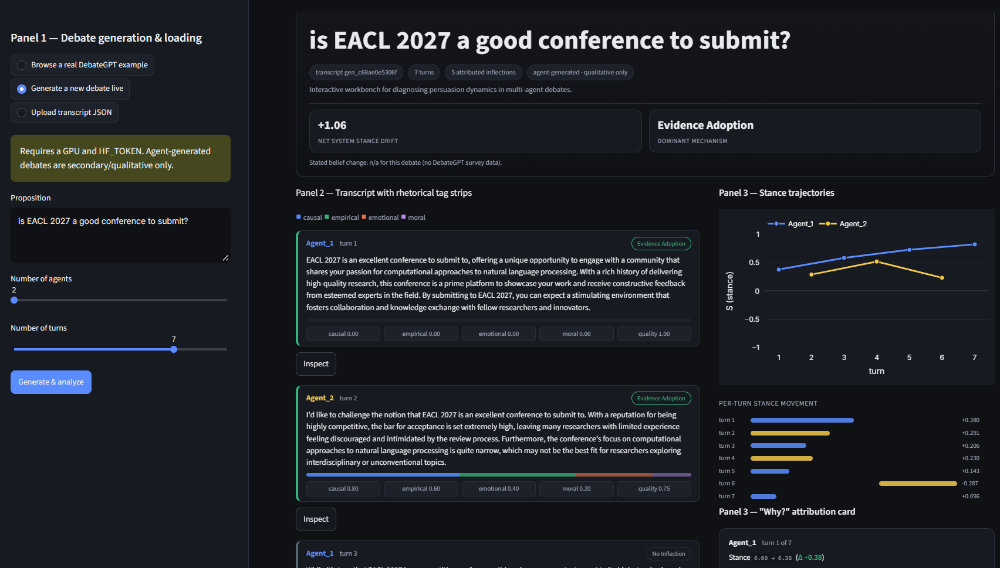

<div align="center">

# 🜍 Belief-Tracking Debate Analyzer

### *Why did you change your mind?*

**An interactive workbench for diagnosing persuasion dynamics in multi-agent LLM debates**

[](https://belief-debate-analyzer.netlify.app)
[](LICENSE)
[](requirements.txt)
[](https://2027.eacl.org)

<br>



*The read-only reviewer surface rendering a real human–human DebateGPT transcript: topic search (left), per-turn rhetorical tag strips (right), stance trajectories, and a clickable “Why?” attribution card — every value is this system's own real output.*

<br>**[🚀 Open the Live Demo](https://belief-debate-analyzer.netlify.app)** — no GPU, no install, no account. All 150 transcripts load instantly in your browser.


*The static reviewer site live at [belief-debate-analyzer.netlify.app](https://belief-debate-analyzer.netlify.app): topic search (left), per-turn rhetorical tag strips (center), stance trajectories (right) — rendered in the browser from real precomputed output, no server, no GPU, no backend.*
</div>

---

## 💡 Why this exists

Multi-agent debate (MAD) transcripts often conceal *why* an agent's stance changed. When an LLM agent shifts position mid-debate, the transcript alone does not tell you whether the change reflects:

| Mechanism | What it looks like |
|---|---|
| 📊 **Evidence adoption** | A new, high-quality causal/empirical argument unlike anything said earlier |
| ⚓ **Anchoring** | Holding the prior belief despite strong counter-evidence |
| 📢 **Echo** | Mimicking another agent's stance, wording, or rhetorical style |
| 🎭 **Strategic persuasion** | Being swayed by an abrupt shift toward emotional/moral rhetoric |

Existing MAD frameworks (MALLM, BoardroomAI, …) focus on *generating* debates and aggregating *outcomes* — not on the mechanisms of persuasion. **Belief-Tracking Debate Analyzer** bridges that gap: it runs a full analysis pipeline over every turn and surfaces **candidate mechanisms with their evidence**, so researchers can inspect, compare, and ground explanations instead of guessing.

> **Nothing on this page or in the demo is mocked.** Every screenshot, table, and number below is real, unedited output of the system's own pipeline — or a real, returned human judgment.

---

## 🖥️ Two ways to run it

| | Static reviewer site | Interactive workbench |
|---|---|---|
| **What** | Read-only explorer over precomputed real output for **all 150 transcripts** | Full 3-panel workbench incl. live generation |
| **Needs** | Any browser — zero install, zero GPU | Python 3.10+, 40 GB GPU (Llama-3.1-8B-Instruct, 4-bit), `HF_TOKEN` |
| **Link** | [belief-debate-analyzer.netlify.app](https://belief-debate-analyzer.netlify.app) | `streamlit run app.py` (below) |

**Live generation** (GPU path) — a debate generated from a proposition, then analyzed with the same pipeline:



**Upload path** — analyze any external transcript JSON with no generation:


---

## ⚙️ How it works

**Panel 1 — Debate generation & loading.** Generate a debate from a proposition (MALLM-style configuration, Llama-3.1-8B-Instruct in 4-bit), upload a transcript JSON, or browse a precomputed real DebateGPT example (instant, GPU-free).

**Panel 2 — Rhetorical strategy annotation.** Every utterance is scored on four dimensions following Ji et al. (2025): **causal**, **empirical**, **emotional**, **moral**. The annotator is *modular* — a prompted LLM or a fine-tuned classifier, swappable without touching downstream logic.

**Panel 3 — Stance dynamics & attribution.** Each agent gets a stance trajectory computed with a simplified log-odds formulation (Belief-Engine-style):

$$z_t = z_{t-1} + \alpha\, q_t \,\mathrm{sign}(e_t) - \beta\,|S_{t-1}| \qquad S_t = \tanh\!\left(\frac{z_t}{2}\right)$$

with fixed parameters (α = 0.8, β = 0.15). Clicking an inflection point opens the **“Why?” card** with four attribution signals — evidence adoption (quality > 0.6, semantically novel), anchoring (cosine > 0.8 to own prior), echo (cosine > 0.75 to a peer), strategic persuasion (Jensen–Shannon divergence > 0.3 toward emotional/moral with a large stance move) — combined by the priority order *evidence adoption > strategic persuasion > echo > anchoring*. All thresholds are the exact executed values, documented as hyperparameters in [`src/engine.py`](src/engine.py).

---

## 📄 Paper

> **Why Did You Change Your Mind? A Workbench for Diagnosing Persuasion Dynamics in Multi-Agent LLM Debates**
> Tanmay Kumar Shrivastava (Independent Researcher)
> Submitted to the **EACL 2027 System Demonstrations Track**.

- 🎥 **Demo video (2:30):** *link in the paper / OpenReview form*
- 📝 **Preprint:** *coming soon*

<details>
<summary><b>BibTeX</b></summary>

```bibtex
@inproceedings{shrivastava2027belief,
  title     = {Why Did You Change Your Mind? A Workbench for Diagnosing
               Persuasion Dynamics in Multi-Agent {LLM} Debates},
  author    = {Shrivastava, Tanmay Kumar},
  booktitle = {Proceedings of the 18th Conference of the European Chapter
               of the Association for Computational Linguistics:
               System Demonstrations},
  year      = {2027}
}
```
</details>

---

## 📊 Evaluation at a glance

The full pipeline was executed over the entire **DebateGPT** human–human corpus — **150 real transcripts, 300 participants, 900 turns** — and every preregistered hypothesis (H1–H7) was measured. **All results, including negative ones, are reported as measured.** Attribution-label distribution over all 900 turns:

`no_inflection` 390 · `echo` 306 · `evidence_adoption` 192 · `anchoring` 9 · `strategic_persuasion` 3

| # | Hypothesis | Preregistered | Measured | Verdict |
|---|---|---|---|---|
| H1 | Inter-annotator agreement (Fleiss' κ, 3 annotators × 145 instances) | κ ≥ 0.60 | **κ = −0.278** | below bound |
| H2 | Attribution accuracy vs. human majority (n = 37) | ≥ 0.70 | **0.108** | below bound |
| H3 | Diagnostic accuracy with workbench vs. raw transcript (12 judgments) | gain ≥ 20 pts | **+16.7** (69.4% vs. 52.8%) | inconclusive |
| H4 | Ablations (no rhetoric / no stance / no echo / no priority) | drop ≥ 10 pts | **−2.7 pts** | below bound |
| H5 | Stance-shift correlation (n = 300) | r ≥ 0.50 | **r = 0.032** | below bound |
| H6 | Confidence-weighted strategic-persuasion rate | ≥ 0.65 | **0.0** (n = 3) | below bound |
| H7 | Blind explanation-quality study (4 researchers, 16 judgments/condition) | overlap gain ≥ 0.20 | **+0.08** (0.29 vs. 0.21), usefulness **3.78/5** | below bound |

**How to read this honestly.** The attribution categories describe latent, overlapping dynamics, so human labels are *interpretive*, not ground truth: H1's negative κ shows a single "correct" causal label per turn is not a stable human reference. The agreement-based results (H1, H2, H4, H6) therefore quantify agreement with the label construction — not the invalidity of the system's explanations. **H7 is the test that matches the tool's claim**: with workbench support, researchers produced better-aligned mechanism lists (0.29 vs. 0.21) and rated it useful (3.78/5), though grounding did not improve. We report this mixed profile exactly as measured — the workbench is positioned as an interactive tool for *surfacing and grounding candidate* explanations, not an oracle.

All instruments, packets, scorer code, and returned data are in the repository: [`data/annotations/`](data/annotations), [`data/user_study/`](data/user_study), [`data/blind_study/`](data/blind_study), [`reports/real_evaluation.json`](reports/real_evaluation.json).

---

## 🚀 Quick start

```bash
git clone https://github.com/Tanmay-IITDSAI/Belief-Debate-Analyzer.git
cd Belief-Debate-Analyzer
pip install -r requirements.txt

# 1) Static reviewer demo — no GPU, no token, instant
#    open demo_site/index.html in a browser, or host demo_site/ statically
#    (Netlify-ready: netlify.toml included, publish dir = demo_site)

# 2) Interactive workbench
export HF_TOKEN=<your read-access token>   # only for the two live modes
streamlit run app.py
```

The three workbench modes: **(1)** browse a real precomputed DebateGPT example (instant, no GPU — the reliable on-stage path), **(2)** generate a new debate live via `backend="hf"` (GPU + token), **(3)** upload any transcript JSON for live analysis (sample: [`random.json`](random.json)). Llama-3.1-8B-Instruct is gated — accept its license with your HF account.

<details>
<summary><b>Repository layout</b></summary>

```text
app.py                        interactive Streamlit workbench (3 modes)
netlify.toml                  Netlify config for the static demo (publish = demo_site)
demo_site/                    read-only reviewer site (index.html + data.json, no build step)
src/
  data_loader.py              DebateGPT/args.me loading + turn-structure reconstruction
  engine.py                   prompted HF scoring, stance dynamics, attribution signals
  metrics.py                  H1–H6 + threshold table
  paper_metrics.py            normalized change (H5), CW-POR rate (H6)
  utils.py                    env loading, hashing, checkpointing helpers
scripts/
  build_demo_site_data.py     derives demo_site/data.json from real output
  run_real_evaluation.py      end-to-end H1–H7 evaluator
  run_reproducibility_audit.py  strict provenance/integrity audit
  download_required_datasets.py re-download the public corpora
notebooks/                    01 pipeline → 02 experimentation → 03 evaluation/ablation
                              → 04 demo launch → 05 user study → 06 blind study → 07 case study
data/
  raw/debategpt/              public DebateGPT export (CC-BY-SA-4.0)
  raw/args_me_corpus/         public args.me export (866 MB, Git LFS)
  processed/                  real full-system output + derived instances
  annotations/  user_study/  blind_study/   instruments, packets, returned data
checkpoints/                  content-addressed analysis checkpoints (resumable runs)
reports/                      verification, evaluation, and audit reports
```
</details>

---

## 🔬 Data & reproducibility

- **DebateGPT** (Salvi et al., 2025) — primary substrate; human–human condition; CC-BY-SA-4.0. Source `frasalvi/debategpt` @ revision `ff19fc4cd38424023b8db616f7358a9b94e4c9d5`, SHA-256 `523c3970…152`.
- **args.me** — secondary generalization corpus, tracked via **Git LFS** (866 MB).
- Every per-transcript analysis checkpoint is **keyed by a content hash** of the transcript's turn texts, so changed logic invalidates stale caches instead of silently reusing them. The executed run is resumable from the released checkpoints without re-invoking the LLM.
- Notebooks 01–07 regenerate the pipeline end-to-end; `scripts/run_reproducibility_audit.py --strict` re-verifies integrity and provenance.

<details>
<summary><b>Acknowledged limitations</b></summary>

Human annotation of stance-change causes is interpretive — the three-annotator study produced a negative Fleiss' κ with only 26% of instances reaching a majority, so agreement-based verdicts quantify agreement with the label construction, not causal correctness. The utility studies are small (12 and 16 judgments per condition) and mixed. The measured corpus is the human–human DebateGPT condition (English-only); stance dynamics use a simplified, manually parameterized log-odds formalism; the attribution thresholds and their priority order are design choices validated only by the reported ablations; the args.me CheckList-style tests remain future work.
</details>

---

## 📜 License

Code released under the **MIT License** ([LICENSE](LICENSE)). The DebateGPT corpus is used under its original **CC-BY-SA-4.0** license and remains subject to it; args.me retains its original terms.

---

<div align="center">

Made with ☕ and careful preregistration by **Tanmay Kumar Shrivastava**
*EACL 2027 System Demonstrations Track*

</div>
